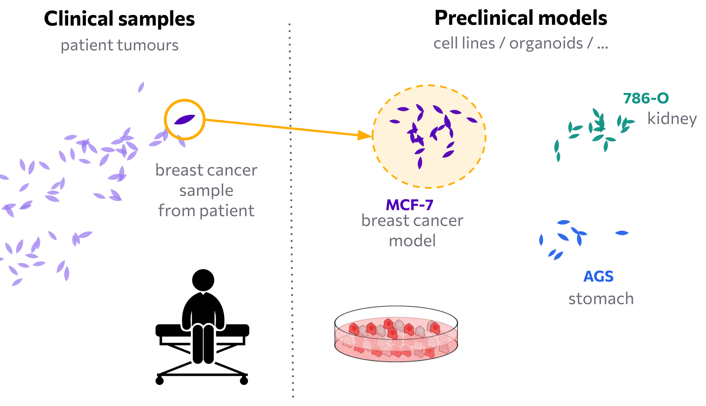
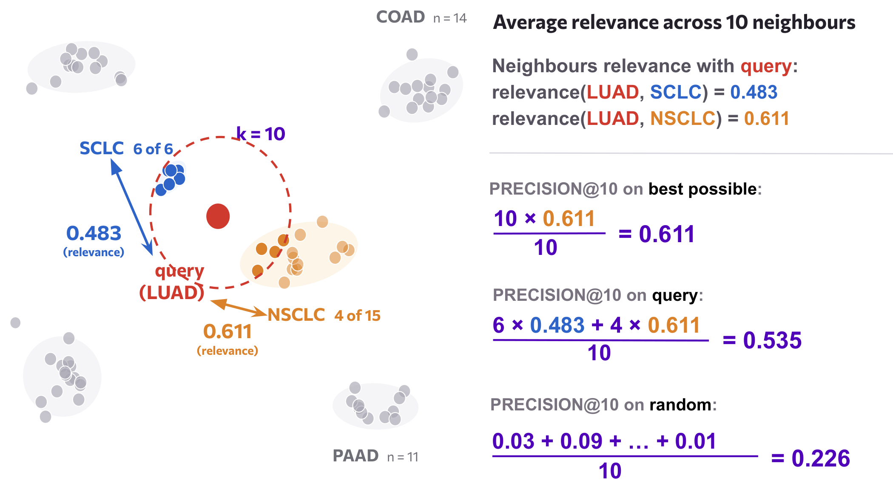
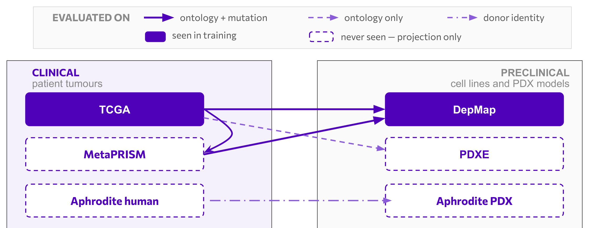
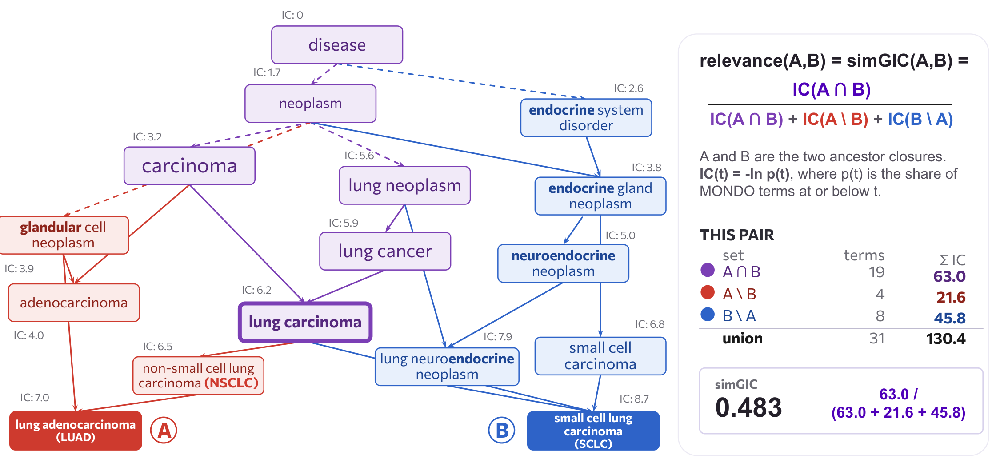
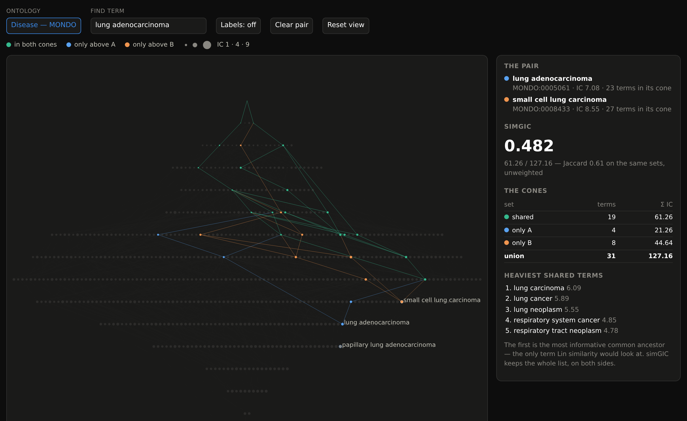

# What counts as a good match?

A three-axis, bounded benchmark for mapping patient tumours to preclinical models.



Embed clinical samples (patient tumours) and preclinical samples (cell lines and
patient-derived xenografts) in one shared space with a model of your choice, retrieve the
k nearest preclinical neighbours of every patient sample, and ask three questions of those
neighbours:

| Axis | Question | Score | Bounds |
|---|---|---|---|
| **Ontology** | Do the neighbours have a similar disease? | simGIC@10 between the query's and each neighbour's MONDO term, a graded graph-based match | random floor, oracle |
| **Mutation** | Do the neighbours carry similar driver-gene alterations? | Jaccard@10 between the query's and each neighbour's set of mutated genes, within a breast, lung or pan-cancer cohort | random floor, oracle |
| **Donor** | Is the neighbour the patient's own xenograft? | precision@1, exact match on the donor | random floor, oracle |

Every score is placed between what a random ranking scores and what the best ranking the
database admits could score, so methods are compared on how much of the achievable
interval they cover.



A query's score is the mean relevance of its k neighbours. The floor is that same average
over a random ranking of the database, the oracle over the best ranking the database
admits — here 0.226 and 0.611, so this retrieval covers four fifths of the interval.

## Mappings

| Query → database | Evaluated on | Seen in training |
|---|---|---|
| TCGA → DepMap | ontology, mutation | both |
| MetaPRISM → DepMap | ontology, mutation | DepMap only |
| TCGA → MetaPRISM | ontology, mutation | TCGA only |
| TCGA → PDXE | ontology | TCGA only |
| Aphrodite human → Aphrodite PDX | donor | neither |

Models are fitted on TCGA and DepMap only. The other datasets are embedded by the fitted
model without retraining, so three of the five mappings measure how the embedding
generalises to data it has never seen.



## Methods and bounds

Three baselines are trained from scratch by the workflow, all into 64 dimensions:

- **PCA** on log1p(TPM)
- **scVI**, a variational autoencoder with a negative-binomial likelihood
- **MOBER**, a variational autoencoder with an adversary that removes the dataset of origin
  from the latent space (vendored from [Novartis/MOBER](baseline-models/MOBER/README.md), MIT)

Celligner and BulkFormer were run with external code that is not part of this repository.

Two bounds are scored on every axis from the labels alone, with no embedding:

- **Random**, the expected score of a uniformly random ranking of the database.
- **Oracle**, the best score any ranking of the database could reach. On the mutation axis
  the oracle is the best ranking that respects disease similarity, that is, what a perfect
  ontology match could achieve at best.

## Results

The three baselines as the workflow last ran them, with both bounds on every row.

### Ontology axis (simGIC@10)

| pair | k | MOBER | PCA | scVI | Random | Oracle |
|---|---|---|---|---|---|---|
| metaprism_to_depmap | 10 | 0.248 | 0.246 | 0.239 | 0.104 | 0.556 |
| tcga_to_depmap | 10 | 0.406 | 0.380 | 0.397 | 0.104 | 0.669 |
| tcga_to_metaprism | 10 | 0.369 | 0.373 | 0.377 | 0.126 | 0.634 |
| tcga_to_pdxe | 10 | 0.326 | 0.315 | 0.329 | 0.130 | 0.513 |

### Mutation axis (Jaccard@10)

| pair | cohort | k | MOBER | PCA | scVI | Random | Oracle |
|---|---|---|---|---|---|---|---|
| metaprism_to_depmap | breast | 10 | 0.089 | 0.086 | 0.100 | 0.079 | 0.227 |
| metaprism_to_depmap | lung | 10 | 0.112 | 0.122 | 0.120 | 0.092 | 0.347 |
| metaprism_to_depmap | pan | 10 | 0.104 | 0.093 | 0.097 | 0.061 | 0.269 |
| tcga_to_depmap | breast | 10 | 0.110 | 0.095 | 0.118 | 0.090 | 0.265 |
| tcga_to_depmap | lung | 10 | 0.111 | 0.124 | 0.114 | 0.096 | 0.337 |
| tcga_to_depmap | pan | 10 | 0.101 | 0.092 | 0.100 | 0.057 | 0.255 |
| tcga_to_metaprism | breast | 10 | 0.064 | 0.050 | 0.066 | 0.045 | 0.102 |
| tcga_to_metaprism | lung | 10 | 0.066 | 0.059 | 0.065 | 0.042 | 0.223 |
| tcga_to_metaprism | pan | 10 | 0.062 | 0.054 | 0.062 | 0.029 | 0.143 |

### Donor axis (precision@1)

| pair | k | MOBER | PCA | scVI | Random | Oracle |
|---|---|---|---|---|---|---|
| aphrodite | 1 | 0.319 | 0.128 | 0.447 | 0.021 | 1.000 |

Read as the share of the random-to-oracle interval covered: on the ontology axis the three
methods sit at 48–53% of it wherever TCGA is the query, and at 30–32% on MetaPRISM →
DepMap, the one mapping whose queries were never seen in training. On the mutation axis
they cover 3–37%, closer to the floor than to the oracle everywhere, and PCA is the weakest
method on all three breast cohorts. On the donor axis scVI covers 43%, MOBER 30% and PCA 11%. The
numbers above are the workflow's own `results/summary.md`; rerunning it rewrites them.

## How a score is computed

*Ontology.* MONDO is a directed acyclic graph. A term's *ancestor closure* is the term plus
everything above it, and every term has an information content IC(t) = −ln p(t), where p(t)
is the share of MONDO terms at or below t. The relevance of a neighbour's term B to the
query's term A is

    simGIC(A, B) = IC(A ∩ B) / IC(A ∪ B)

summed over the two closures. Identical terms score 1; a neighbour annotated one level
away still earns credit, which an exact-match metric would not give. Almost every pair of
diseases shares something above the root, so scores floor well above zero, and the random
bound shows where. simGIC@10 is the mean relevance of a query's ten nearest neighbours,
averaged over the queries of each cancer type and then over cancer types, a type with n
queries weighing √n.



The [simGIC explorer](docs/simgic-explorer/simgic_explorer.html) draws the two ancestor
closures of any pair of terms in the benchmark next to their score, on the same graph and
with the same weights the benchmark scores with.



*Mutation.* Each sample's mutations are a binary vector over the genes every mutation
source was assayed on, in practice MetaPRISM's targeted panel of cancer driver genes. A
neighbour is worth the Jaccard overlap between its set of mutated genes and the query's;
Jaccard@10 is the mean over the ten nearest neighbours, averaged over queries.

*Donor.* Each patient in the Aphrodite study has a tumour sample and one or two
xenografts grown from it. A neighbour is worth 1 when it is the query's own xenograft.

## Data

Every input comes from one HuggingFace dataset,
[`ingenix/mapping_benchmark`](https://huggingface.co/datasets/ingenix/mapping_benchmark):
TPM expression for TCGA, DepMap, MetaPRISM, PDXE and the Aphrodite study (GSE317901) on a
common 19,260-gene panel, every sample's MONDO term, the MONDO graph, and the somatic
mutations as three long tables (which genes are mutated in which sample, which samples
have calls, which genes each dataset was assayed on). Which files are read, and which
samples are left out, is in
[resources/datasets.yaml](benchmark-workflow/resources/datasets.yaml). The primary sources
carry their own terms of use; see the dataset card.

## Running the benchmark

Prerequisites: [uv](https://docs.astral.sh/uv/getting-started/installation/), about 6 GB
of disk for the inputs and outputs, and a GPU for scVI and MOBER (both fall back to CPU).

```bash
uv sync --locked
for d in baseline-models/*/; do uv sync --locked --directory "$d"; done
uv run --frozen snakemake -s benchmark-workflow/Snakefile --cores 4 --scheduler greedy
```

`--scheduler greedy` selects Snakemake's fast scheduler. Add `-n` for a dry run. A single
cell can be requested by its output file, for example
`results/ontology/tcga_to_depmap/PCA.json`, which downloads the data, selects genes, fits
PCA and scores it without touching the other methods. Everything the workflow decides is
in [config.yaml](benchmark-workflow/config.yaml): the training datasets, the gene panel
size, the k of each axis, the mappings, the cohorts and the methods' hyperparameters.

## Outputs

```
results/models/{method}/          latents.npy, latents.csv, and the fitted model
results/ontology/{pair}/          {PCA,scVI,MOBER,Random,Oracle}.json
results/mutation/{pair}/{cohort}/ {PCA,scVI,MOBER,Random,Oracle}.json
results/donor/aphrodite/          {PCA,scVI,MOBER,Random,Oracle}.json
results/summary.csv               every score, one row per axis, pair, cohort, method and k
results/summary.md                one table per axis, methods as columns, bounds last
results/summary.pdf, .png         the three axes as random-to-oracle bars with method marks
```

Each JSON holds the score per k together with per-label scores and the number of query and
database samples that were scored.

## Adding a method

A method is a `train` step that reads `data/processed/training.h5ad` (TPM on the gene
panel, with a `data_source` obs column) and a `project` step that writes
`results/models/{method}/latents.npy` plus `latents.csv`, the input's obs in the same
order. Add a `methods:` entry with a new `type` in `config.yaml` and a pair of rules in
the [Snakefile](benchmark-workflow/Snakefile) following the PCA ones; the evaluation and
summary rules pick the method up from there.

## Layout

```
benchmark-workflow/     Snakefile, config.yaml, resources/, scripts/ (one script per rule)
src/mapping_benchmark/  datasets (inputs), ontology (MONDO, simGIC), retrieval (axes 1, 3), mutation (axis 2)
baseline-models/        SimplePCA, scVI, MOBER, each with its own environment
docs/                   the interactive simGIC explorer, and the README figures
tests/                  pytest suite: uv run --frozen pytest
```

## Licence

Apache License 2.0; see [LICENSE](LICENSE) and [NOTICE](NOTICE). The vendored MOBER code in
[baseline-models/MOBER](baseline-models/MOBER/README.md) keeps its upstream MIT licence. The
data has its own terms; see the dataset card.
